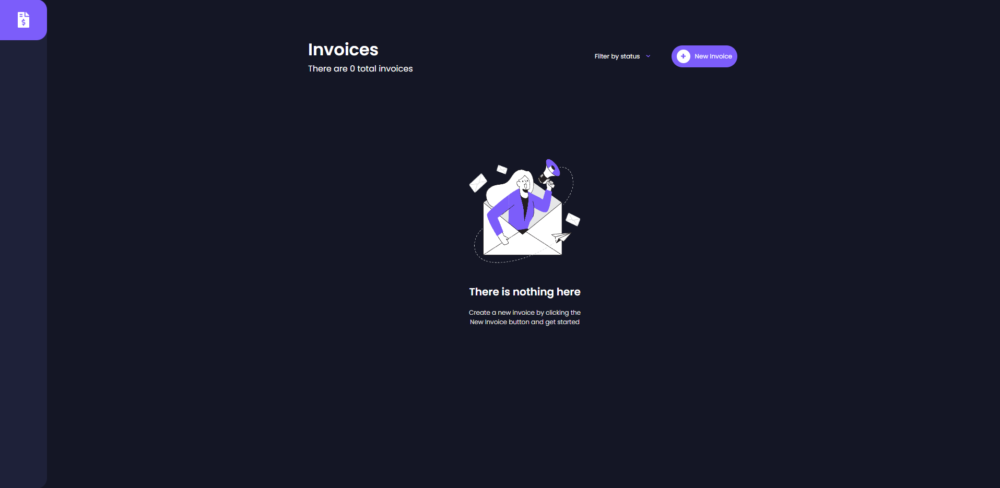
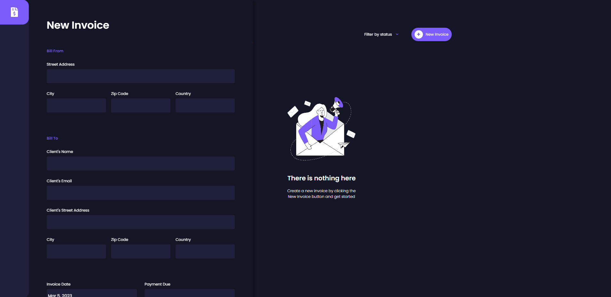
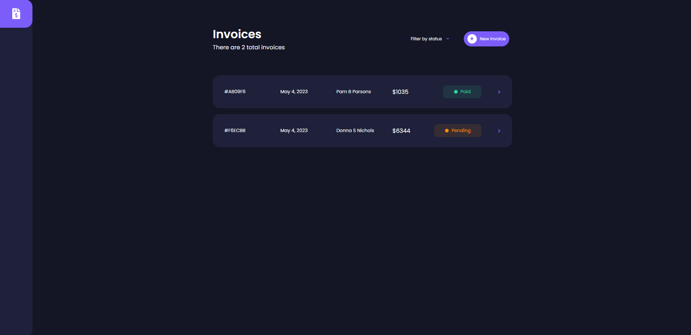
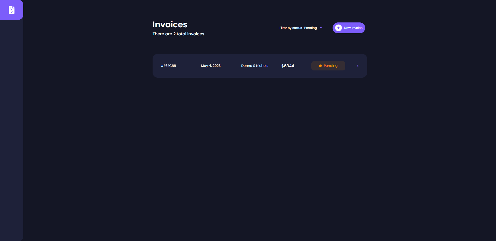
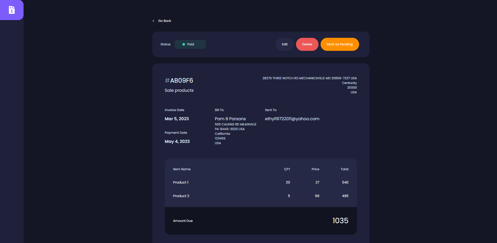
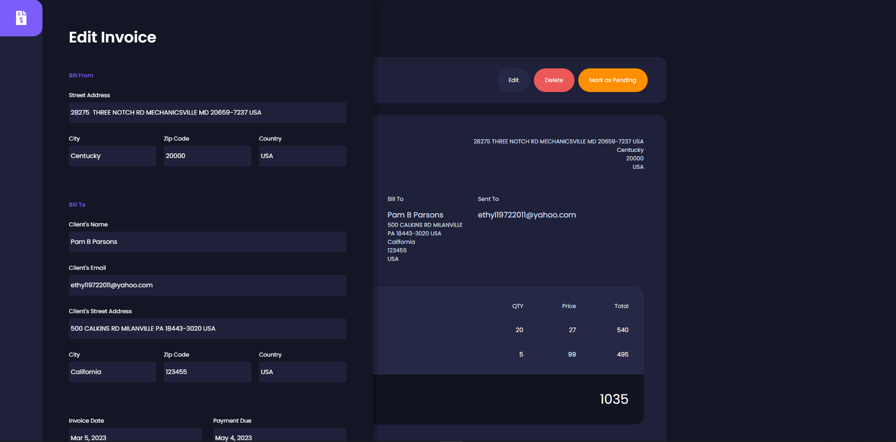

# Vue Invoice App 📃💵

- ***You can create a new invoice.***
- ***You can reissue the invoice.***
- ***You can delete the invoice.***
- ***You can filter the invoice according to its status.***
- ***[`Firebase`](https://firebase.google.com/) was used to store datas in the database.***


## Built With 🛠
<ul>
<li>
<a target="_blank" href="https://vuejs.org/">Vue.js</a>
</li>
<li>
<a target="_blank" href="https://vuex.vuejs.org/#what-is-a-state-management-pattern">Vuex</a>
</li>
<li>
<a target="_blank" href="https://firebase.google.com/">Firebase</a>
</li>
</ul>


## Installation ⚡

<ul>

<li>
<p>Clone the repo</p>
<pre>
<code>https://github.com/ufukcankurt/vue-invoice-app.git</code>
</pre>
</li>
<li>
<p>İnstall all dependencies</p>
<pre>
<code> yarn ||  yarn install </code>
</pre>
</li>
<li>
Create .env.local file at the top of the application and add these parameters
<pre>
<code> VUE_APP_API_KEY=</code>
<code> VUE_APP_AUTH_DOMAIN=</code>
<code> VUE_APP_PROJECT_ID=</code>
<code> VUE_APP_STORAGE_BUCKET=</code>
<code> VUE_APP_MESSAGING_SENDER_ID=</code>
<code> VUE_APP_APP_ID=</code>
</pre>
You must first create a collection in
<a target="_blank" href="https://console.firebase.google.com/u/0/">Firebase Console</a>. <br>


</li>

<li>
<p>Run the development server:</p>


```bash
npm run serve
# or
yarn serve
```

</li>
</ul>

## Screenshots 📸

- ***If there is no invoice we'll see message like that.***
<p align="center" style="padding: 10px">


- ***We can add new invoice from left side.***
<p align="center" style="padding: 10px">


- ***We can see all these invoices at home page.***
<p align="center" style="padding: 10px">


- ***We can filter invoices by their status.***
<p align="center" style="padding: 10px">


- ***We can see all details about related invoice from invoice detail page.***
<p align="center" style="padding: 10px">


- ***If we want to edit related invoice, we can edit this invoice after  click edit button.***
<p align="center" style="padding: 10px">


__________
